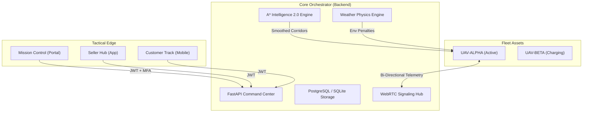

# 🛰️ Nairobi UAV Mission Control OS v4.2

[](https://github.com/youngwheezy001/drone-delivery-platform)
[](https://github.com/youngwheezy001/drone-delivery-platform)

A state-of-the-art, high-fidelity autonomous logistics orchestration platform. Designed for real-time fleet management, strategic intelligence, and secure mission command in advanced urban environments.

## 📡 Live Ecosystem Architecture



## 🚀 Strategic Features

### 🛸 Autonomous Navigation (A* 2.0)
The platform features a custom-built **High-Resolution A* Planner** capable of navigating complex urban exclusion zones.
- **String Pulling Smoothing**: Post-processes grid paths into silky-smooth, efficient straight-line flight corridors.
- **Adaptive Precision**: 120x high-resolution grid for tight obstacle avoidance.
- **No-Fly Zone Enforcement**: Real-time geofence checking against KCAA-regulated exclusion zones.

### ⛈️ Environmental Physics (Weather 1.0)
Integrated **Atmospheric Radar Feedback** that directly impacts fleet performance:
- **Storm Correlation**: Drones entering the radar zone experience **2.5x battery drain** and **40% speed reduction**.
- **Tactical HUD Alerts**: Real-time environmental turbulence warnings for operators.

### 🔐 System Hardening
- **Multi-Factor Uplink**: JWT-based authentication combined with a **Biometric Handprint Scanner** simulation for secure mission command.
- **Role-Based Access**: Strict `is_admin` dependency enforcement for all strategic telemetry and analytics.

### 🐝 Swarm situational Awareness
- **Collision Avoidance**: Real-time haversine distance scanning between all active fleet nodes.
- **Conflict Monitoring**: High-visibility mapping of proximity breaches with automated diagnostic logging.

## 🛠️ Technology Stack
- **Frontend**: Next.js 15, Tailwind CSS, Zustand (Global State).
- **Mapping**: MapLibre GL (Token-Free Vector Engine).
- **Real-Time**: WebRTC (FPV Video), WebSockets (Telemetry).
- **Backend**: FastAPI (Python 3.10+), SQLAlchemy (Async).
- **Analytics**: Recharts (Tactical Yield Matrix).

## 🛰️ Quick Start (Operator Mode)

1. **Environment Setup**:
   ```bash
   # Backend
   cd backend && pip install -r requirements.txt
   python app/main.py

   # Frontend
   cd frontend && npm install
   npm run dev
   ```

2. **Access Control**:
   - Navigate to `http://localhost:3000/login`
   - Use authorized operator credentials.
   - Complete the **Biometric Scan** to establish the secure uplink.

---

> [!CAUTION]
> **Operational Warning**: Autonomous divert is recommended when flying through high-intensity radar zones. Monitor battery telemetry closely during storm overlap.

*Proprietary OS v4.2 © 2026 Tustar Defense Systems / Megascript Digital.*
